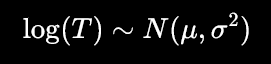
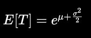
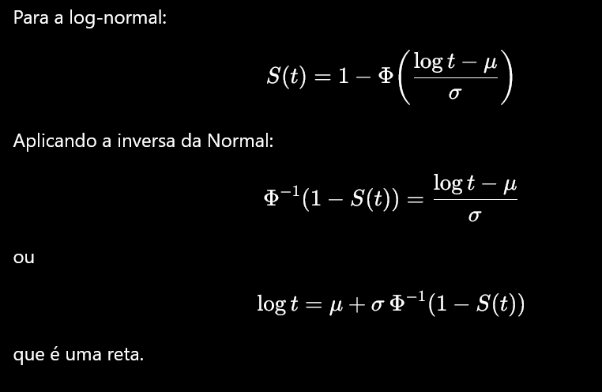

Tem 60 isolantes térmicos funcionando a 200C, estudo parou quando 45 falharam.

Tempos em horas!

```{r}

library(survival)
library(flexsurv)
```

```{r}

tempo <- c(
  151,164,336,365,403,454,455,473,538,577,592,628,632,647,675,727,785,
  801,811,816,867,893,930,937,976,1008,1040,1051,1060,1183,1329,1334,
  1379,1380,1633,1769,1827,1831,1849,2016,2282,2415,2430,2686,2729
)

status <- c(rep(1,45), rep(0,15))

tempo <- c(
  tempo,
  rep(2729,15)
  )

tempo
status # 0 censura, 1 é a falha
```

```{r}

isoladores <- data.frame(
  TIME = tempo,
  CENS = status
)
```

```{r}

km <- survfit(Surv(TIME, CENS) ~ 1, data = isoladores)

plot(km)
```

## Questão A

Ajustar um modelo paramétrico!

```{r}

# garde de tempos
t <- seq(0, max(isoladores$TIME), length.out = 500)
```

```{r}

# Exponencial

reg.exp <- survreg(
  Surv(TIME, CENS) ~ 1, # sem covariáveis
  data = isoladores,
  dist = "exponential"
)

S.exp <- 1 - pweibull(t, shape = 1, scale = exp(reg.exp$coefficients))

summary(reg.exp)
```

```{r}

# Weibull

reg.weib <- survreg(
  Surv(TIME, CENS) ~ 1, # sem covariáveis
  data = isoladores,
  dist = "weibull"
)

S.weib <- 1 - pweibull(
  t,
  shape = 1 / reg.weib$scale,
  scale = exp(reg.weib$coef)
)

summary(reg.weib)
```

```{r}

# Lognormal

reg.lognorm <- survreg(
  Surv(TIME, CENS) ~ 1, # sem covariáveis
  data = isoladores,
  dist = "lognormal"
)

S.lnorm <- 1 - plnorm(
  t,
  meanlog = reg.lognorm$coef,
  sdlog = reg.lognorm$scale
)

summary(reg.lognorm)
```

```{r}

# Loglogística

reg.loglogis <- survreg(
  Surv(TIME, CENS) ~ 1, # sem covariáveis
  data = isoladores,
  dist = "loglogistic"
)

S.llogis <- 1 - plogis(
  log(t),
  location = reg.loglogis$coef,
  scale = reg.loglogis$scale
)

summary(reg.loglogis)
```

```{r}

# Gráfico
plot(
  km,
  conf.int = FALSE,
  xlab = "Tempo",
  ylab = "S(t)",
  main = "Kaplan-Meier vs Exponencial",
  lwd = 2
)

lines(t, S.exp,    lwd = 2, lty = 2)
#lines(t, S.weib,   lwd = 2, lty = 3)
#lines(t, S.lnorm,  lwd = 2, lty = 4)
#lines(t, S.llogis, lwd = 2, lty = 5)

legend(
  "topright",
  legend = c("Kaplan-Meier", "Exponencial"),
  lwd = 2,
  lty = c(1, 2, 3, 4, 5),
  bty = "n"
)
```

```{r}

# Gráfico
plot(
  km,
  conf.int = FALSE,
  xlab = "Tempo",
  ylab = "S(t)",
  main = "Kaplan-Meier vs Weibull",
  lwd = 2
)

#lines(t, S.exp,    lwd = 2, lty = 2)
lines(t, S.weib,   lwd = 2, lty = 3)
#lines(t, S.lnorm,  lwd = 2, lty = 4)
#lines(t, S.llogis, lwd = 2, lty = 5)

legend(
  "topright",
  legend = c("Kaplan-Meier", "Weibull"),
  lwd = 2,
  lty = c(1, 2, 3, 4, 5),
  bty = "n"
)
```

```{r}

# Gráfico
plot(
  km,
  conf.int = FALSE,
  xlab = "Tempo",
  ylab = "S(t)",
  main = "Kaplan-Meier vs LogNorm",
  lwd = 2
)

#lines(t, S.exp,    lwd = 2, lty = 2)
#lines(t, S.weib,   lwd = 2, lty = 3)
lines(t, S.lnorm,  lwd = 2, lty = 4)
#lines(t, S.llogis, lwd = 2, lty = 5)

legend(
  "topright",
  legend = c("Kaplan-Meier", "LogNorm"),
  lwd = 2,
  lty = c(1, 2, 3, 4, 5),
  bty = "n"
)
```

```{r}

# Gráfico
plot(
  km,
  conf.int = FALSE,
  xlab = "Tempo",
  ylab = "S(t)",
  main = "Kaplan-Meier vs LogLogis",
  lwd = 2
)

#lines(t, S.exp,    lwd = 2, lty = 2)
#lines(t, S.weib,   lwd = 2, lty = 3)
#lines(t, S.lnorm,  lwd = 2, lty = 4)
lines(t, S.llogis, lwd = 2, lty = 5)

legend(
  "topright",
  legend = c("Kaplan-Meier", "LogLogis"),
  lwd = 2,
  lty = c(1, 2, 3, 4, 5),
  bty = "n"
)
```

Visualmente parece que tá entre a log normal e a log logística?

### Usando critérios de informação para escolher o melhor modelo

```{r}

AIC(reg.exp, reg.weib, reg.lognorm, reg.loglogis)
```

```{r}

BIC(reg.exp, reg.weib, reg.lognorm, reg.loglogis)
```

Menor é melhor e valor absoluto não importa.

**O vencedor é o modelo log-normal.**

## Questão B

Quero tempo médio, mediano e percentual de falhar



```{r}

mu <- reg.lognorm$coef[1]   # média
sigma <- reg.lognorm$scale  # desvio padrão

print(mu)
print(sigma)
```

```{r}

mediana <- exp(mu) # mediana da normal é sua média mu, logo é só aplica exp
mediana
```



```{r}

media <- exp(mu + sigma^2 / 2)
media
```

## Questão C (extra)

Gráfico TTT

```{r}

install.packages("AdequacyModel")
```

```{r}

library(AdequacyModel)

TTT(tempo[status == 1])
```

-   Curva abaixo da diagonal → taxa de falha crescente (IFR)

<!-- -->

-    Curva acima da diagonal → taxa de falha decrescente (DFR)

<!-- -->

-    Formato em "S" → taxa em banheira (bathtub)

<!-- -->

-    Formato em "S" invertido → unimodal

## Questão D

Linerização como estratégia para ver se o modelo ta bom.



```{r}

km <- survfit(Surv(TIME,CENS)~1, data=isoladores)

S <- km$surv
t <- km$time
```

```{r}

idx <- S > 0 & S < 1

x <- qnorm(1 - S[idx])
y <- log(t[idx])

plot(x, y)
abline(lm(y ~ x), col = 2, lwd = 2)
```

## Questão E (extra)

Resíduos de Cox.

A ideia é transformar os tempos observados em uma variável que, se o modelo estiver correto, deve seguir uma distribuição Exponencial(1).

```{r}

# resíduo = H(t)
# H(t) = -log(S)

S <- 1 - plnorm(
  isoladores$TIME,
  meanlog = mu,
  sdlog = sigma
)

coxsnell <- -log(S)

# ajusto kaplan meier aos resíduos
km.cs <- survfit(
  Surv(coxsnell, isoladores$CENS) ~ 1
)

# pego essa nova hazard acumulada
H.emp <- -log(km.cs$surv)
```

```{r}

plot(
  km.cs$time,
  H.emp,
  xlab = "Resíduo Cox-Snell",
  ylab = "Hazard acumulada"
)

abline(0, 1, col = 2, lwd = 2)
```

-   Muito próximo da reta → ajuste bom.

<!-- -->

-    Curvatura sistemática → ajuste ruim.

```{r}

plot(H.emp)
```

Tem que ser mais ou menos uma Exp(1)
