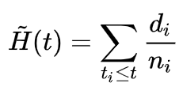

## Dados para Kaplan-Meier

```{r setup, message=FALSE, warning=FALSE}
library(survival)
```

```{r}

dados <- read.csv("dados_lista_2_ex3.csv")

dados$recaida <- as.integer(dados$recaida)

# sexo do paciente
dados$sexo <- factor(dados$sexo, levels = c(0, 1), labels = c("Masculino", "Feminino"))

# Os dois diferentes grupos de comparação - remédio ou não
dados$tto <- factor(dados$tto, levels = c(0, 1), labels = c("Controle", "Tratamento"))

dados$logWBC <- as.double(dados$logWBC)

dados
summary(dados)
```

`recaida = 1` indica evento e `recaida = 0` indica censura.

## Letras "A" e "B"

### Curva de Kaplan-Meier geral

```{r}

# O 1 significa “sem covariáveis”. É o dataset inteiro.
ajuste_geral <- survfit(Surv(tempo, recaida) ~ 1,
                        data = dados)

plot(
  ajuste_geral,
  xlab = "Tempo",
  ylab = "Probabilidade de sobreviver sem recaida",
  main = "Kaplan-Meier geral",
  lwd = 2,
  mark.time = TRUE
)

summary(ajuste_geral)
```

### Curvas por tratamento

```{r}

# Agora a covariável é o tipo de medicamento
ajuste_tto <- survfit(Surv(tempo, recaida) ~ tto,
                      data = dados)

plot(
  ajuste_tto,
  col = c("firebrick", "steelblue"),
  lwd = 2,
  xlab = "Tempo",
  ylab = "Probabilidade de sobreviver sem recaida",
  main = "Kaplan-Meier por tratamento",
  mark.time = TRUE
)

legend(
  "topright",
  legend = levels(dados$tto),
  col = c("firebrick", "steelblue"),
  lwd = 2,
  bty = "n"
)

summary(ajuste_tto)
survdiff(Surv(tempo, recaida) ~ tto, data = dados)
```

### Curvas por sexo

```{r}
ajuste_sexo <- survfit(Surv(tempo, recaida) ~ sexo, data = dados)

plot(
  ajuste_sexo,
  col = c("darkgreen", "goldenrod"),
  lwd = 2,
  xlab = "Tempo",
  ylab = "Probabilidade de sobreviver sem recaida",
  main = "Kaplan-Meier por sexo",
  mark.time = TRUE
)

legend(
  "topright",
  legend = levels(dados$sexo),
  col = c("darkgreen", "goldenrod"),
  lwd = 2,
  bty = "n"
)

summary(ajuste_sexo)
survdiff(Surv(tempo, recaida) ~ sexo, data = dados)
```

O remédio controle tem uma sobrevida maior (curva vermelha) em todos os tempos "t" do que quando comparamos com a curva de sobrevida dos indivíduos que tiveram o tratamento (curva azul).

Se o tempo médio de sobrevida é a área em baixo da curva de S(t) e o tempo mediano é o ponto onde S(t) = 0,5 já é possível averiguar que em ambos os casos o grupo de controle é maior.

```{r}

quantile(ajuste_tto, probs = 0.5)
```

```{r}

summary_tto <- summary(ajuste_tto)
unique(summary_tto$strata)
```

Vou acessar o time e surv de cada grupo.

```{r}

idx <- summary_tto$strata == "tto=Tratamento"

t <- summary_tto$time[idx]
S <- summary_tto$surv[idx]

# adiciona tempo inicial
t_ext <- c(0, t)
S_ext <- c(1, S)

# calculo da área sob a curva
media_tratamento <- sum(diff(t_ext) * S_ext[-length(S_ext)])

media_tratamento
```

```{r}

idx <- summary_tto$strata == "tto=Controle"

t <- summary_tto$time[idx]
S <- summary_tto$surv[idx]

# adiciona tempo inicial
t_ext <- c(0, t)
S_ext <- c(1, S)

# calculo da área sob a curva
media_controle <- sum(diff(t_ext) * S_ext[-length(S_ext)])

media_controle
```

## Letra C



Obtenha o intervalo de confiança com a transformações log e log-log para o estimador de Nelson-Aalen no instante t = 12 para os dois grupos. Use um nível de confiança de 94%.

### Nelson Aalen -\> Log-Log

```{r}

# H(t) = -log(S(t))
# Uso essa relação para recuperar tanto o IC como o H(i) em si

# Nelson-Aalen - H(t) com IC log-log Grupo 1
ajuste_na_log_log <- survfit(Surv(tempo, recaida) ~ tto, data = dados, type = "fleming-harrington", conf.type = "log-log" , conf.int  = 0.94)

# Tratamento
summary_tto <- summary(ajuste_na_log_log)

idx <- summary_tto$strata == "tto=Tratamento"

t <- summary_tto$time[idx]
S <- summary_tto$surv[idx]
l <- summary_tto$lower[idx]
u <- summary_tto$upper[idx]


df_na_log_log_tratamento <- data.frame(
  surv                    = S,        # S(t)  
  time                    = t,
  risco_acc               = -log(S),  # H(t) = -log(S(t))
  risco_ic_lower          = -log(l), # H(t) = -log(S(t))
  risco_ic_upper          = -log(u)  # H(t) = -log(S(t))
)

idx <- summary_tto$strata == "tto=Controle"

t <- summary_tto$time[idx]
S <- summary_tto$surv[idx]
l <- summary_tto$lower[idx]
u <- summary_tto$upper[idx]


df_na_log_log_controle <- data.frame(
  surv                    = S,        # S(t)  
  time                    = t,
  risco_acc               = -log(S),  # H(t) = -log(S(t))
  risco_ic_lower          = -log(l), # H(t) = -log(S(t))
  risco_ic_upper          = -log(u)  # H(t) = -log(S(t))
)
```

```{r}

df_na_log_log_controle[df_na_log_log_controle$time == 13, ]

```

```{r}

df_na_log_log_tratamento[df_na_log_log_tratamento$time == 12, ]
```

Risco muito maior no tratamento, como antes.

### Nelson Aalen -\> Log

```{r}

# H(t) = -log(S(t))
# Uso essa relação para recuperar tanto o IC como o H(i) em si

# Nelson-Aalen - H(t) com IC log-log Grupo 1
ajuste_na_log <- survfit(Surv(tempo, recaida) ~ tto, data = dados, type = "fleming-harrington", conf.type = "log" , conf.int  = 0.94)

# Tratamento
summary_tto <- summary(ajuste_na_log_log)

idx <- summary_tto$strata == "tto=Tratamento"

t <- summary_tto$time[idx]
S <- summary_tto$surv[idx]
l <- summary_tto$lower[idx]
u <- summary_tto$upper[idx]


df_na_log_tratamento <- data.frame(
  surv                    = S,        # S(t)  
  time                    = t,
  risco_acc               = -log(S),  # H(t) = -log(S(t))
  risco_ic_lower          = -log(l), # H(t) = -log(S(t))
  risco_ic_upper          = -log(u)  # H(t) = -log(S(t))
)

idx <- summary_tto$strata == "tto=Controle"

t <- summary_tto$time[idx]
S <- summary_tto$surv[idx]
l <- summary_tto$lower[idx]
u <- summary_tto$upper[idx]


df_na_log_controle <- data.frame(
  surv                    = S,        # S(t)  
  time                    = t,
  risco_acc               = -log(S),  # H(t) = -log(S(t))
  risco_ic_lower          = -log(l), # H(t) = -log(S(t))
  risco_ic_upper          = -log(u)  # H(t) = -log(S(t))
)

```

```{r}

df_na_log_controle[df_na_log_controle$time == 13, ]
```

```{r}

df_na_log_tratamento[df_na_log_tratamento$time == 12, ]
```

## Letra D

Variável logWBC:

-   baixa: 0 \<= logWBC \<= 2,30

-   media: 2,31 \<= logWBC \<= 3,0

-   alta: \> 3,0

logWBC_ctgr

```{r}

dados$logWBC_ctgr <- NA

for (i in 1:nrow(dados)) {
  
  if (dados$logWBC[i] >= 0) {
  
    dados$logWBC_ctgr[i] <- "baixa"
  
  } 
  
  if (dados$logWBC[i] >= 2.31 && dados$logWBC[i] <= 3) {
  
    dados$logWBC_ctgr[i] <- "media"
  
  } 
  
  if (dados$logWBC[i] > 3){
    
    dados$logWBC_ctgr[i] <- "alta"
  
  }
  
}

dados$logWBC_ctgr <- factor(dados$logWBC_ctgr)
dados$logWBC_ctgr
```

```{r}

ajuste_tto_logWBC <- survfit(Surv(tempo, recaida) ~ logWBC_ctgr,
                      data = dados)

plot(
  ajuste_tto_logWBC,
  col = c("firebrick", "steelblue", "darkgreen"),
  lwd = 3,
  xlab = "Tempo",
  ylab = "Probabilidade de sobreviver sem recaida",
  main = "Kaplan-Meier por logWBC_ctgr",
  mark.time = TRUE
)

legend(
  "topright",
  legend = levels(dados$logWBC_ctgr),
  col = c("firebrick", "steelblue", "darkgreen"),
  lwd = 3,
  bty = "n"
)

```

Essa variável é a contagem de células brancas. Com uma quantidade mais alta, sobvrevida mais baixa. Com uma quantidade menor, sobrevida maior.

## Letra E

Risco acumulado do estimador de Nelson Aalen e de Kaplan Meier.

```{r}

summary(ajuste_tto_logWBC)
```

```{r}

plot(
  ajuste_tto_logWBC,
  fun = "cumhaz", # essa função aqui ja faz H(t) = -log(S(t))
  col = c("firebrick", "steelblue", "darkgreen"),
  lwd = 3,
  xlab = "Tempo",
  ylab = "Hazard acumulada",
  main = "Kaplan-Meier: Hazard acumulada por logWBC_ctgr",
  mark.time = TRUE
)

legend(
  "topleft",
  legend = levels(factor(dados$logWBC_ctgr)),
  col = c("firebrick", "steelblue", "darkgreen"),
  lwd = 3,
  bty = "n"
)

```

```{r}

ajuste_na_logWBC <- survfit(Surv(tempo, recaida) ~ logWBC_ctgr, data = dados, type = "fleming-harrington")
```

```{r}

plot(
  ajuste_na_logWBC,
  fun = "cumhaz", # essa função aqui ja faz H(t) = -log(S(t))
  col = c("firebrick", "steelblue", "darkgreen"),
  lwd = 3,
  xlab = "Tempo",
  ylab = "Hazard acumulada",
  main = "Nelson Aalen: Hazard acumulada por logWBC_ctgr",
  mark.time = TRUE
)

legend(
  "topleft",
  legend = levels(factor(dados$logWBC_ctgr)),
  col = c("firebrick", "steelblue", "darkgreen"),
  lwd = 3,
  bty = "n"
)

```

```{r}

plot(
  ajuste_tto_logWBC,
  fun = "cumhaz",
  col = c("firebrick", "steelblue", "darkgreen"),
  lwd = 3,
  lty = 1,
  xlab = "Tempo",
  ylab = "Hazard acumulada",
  main = "Kaplan-Meier vs Nelson-Aalen",
  mark.time = TRUE
)

lines(
  ajuste_na_logWBC,
  fun = "cumhaz",
  col = c("firebrick", "steelblue", "darkgreen"),
  lwd = 3,
  lty = 2,
  mark.time = FALSE
)

legend(
  "topleft",
  legend = c(
    "Baixo - KM", "Medio - KM", "Alto - KM",
    "Baixo - NA", "Medio - NA", "Alto - NA"
  ),
  col = c("firebrick", "steelblue", "darkgreen",
          "firebrick", "steelblue", "darkgreen"),
  lwd = 3,
  lty = c(1, 1, 1, 2, 2, 2),
  bty = "n"
)

```

É praticamente igual os dois estimadores nesse caso.

## Letra F

H0 é as curvas serem todas iguais

H1 é as curvas serem diferentes

```{r}

teste <- survdiff(Surv(tempo, recaida) ~ logWBC_ctgr, data = dados)
teste
```

```{r}

# p value
1 - pchisq(teste$chisq, df = length(teste$n) - 1)
```

Muito pequeno, rejeito H0.

Muito alto, aceito H0.

Nesse caso eu rejeito H0, as curvas tem diferença estatística relevante.

```{r}

install.packages("coin")
library(coin)
```

```{r}

teste_wilcoxon <- logrank_test(
  Surv(tempo, recaida) ~ logWBC_ctgr,
  data = dados,
  type = "Gehan-Breslow"
)

# Peto-Peto
peto <- survdiff(Surv(tempo, recaida) ~ logWBC_ctgr, data = dados, rho = 1)

# Fleming-Harrington com gamma = 0 e rho = 2
fh <- survdiff(Surv(tempo, recaida) ~ logWBC_ctgr, data = dados, rho = 2)
```

```{r}

teste_wilcoxon
```

```{r}

print(1 - pchisq(peto$chisq, df = length(teste$n) - 1))
print(1 - pchisq(fh$chisq, df = length(teste$n) - 1))

```

Todos os testes indicam p-values pequenos. H0 é rejeitado!
