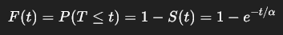

```{r}

library(survival)
```

```{r}

tempos <- c(
  151, 164, 336, 365, 403, 454, 455, 473, 538, 577,
  592, 628, 632, 647, 675, 727, 785, 801, 811, 816,
  592, 628, 632, 937, 976, 1008, 1051, 1060, 1183, 1329,
  1334, 1379, 1380, 1633, 1769, 1827, 1831, 849, 2016, 1040,
  2282, 2415, 2430, 2686, 2729, 2729, 2729, 2729, 2729, 2729,
  2729, 2729, 2729, 2729, 2729, 2729, 2729, 2729, 2729, 2729
)

cens <- c(
  1, 1, 1, 1, 1, 1, 1, 1, 1, 1,
  1, 1, 1, 1, 1, 1, 1, 1, 1, 1,
  1, 1, 1, 1, 1, 1, 1, 1, 1, 1,
  1, 1, 1, 1, 1, 1, 1, 1, 1, 1,
  1, 1, 1, 1, 1, 0, 0, 0, 0, 0,
  0, 0, 0, 0, 0, 0, 0, 0, 0, 0
)
```

```{r}

# Kaplan-Meier
km <- survfit(Surv(tempos, cens) ~ 1)
summary(km)
```

```{r}

plot(km)
```

# Ajustar isso para diferentes distribuições

-   Exponencial

-   Weibull

-   log-normal

-   log-logística

### Exponencial

S(t) = exp{-t / alpha}

```{r}

ajust1 <- survreg(Surv(tempos,cens)~1, dist="exponential")
ajust1

alpha <- exp(ajust1$coefficients[1])
alpha
```

```{r}

# Curva ajustada pelo modelo exponencial
t <- seq(0, max(tempos), length.out = 200)
S_exp <- exp(-t / alpha)


plot(
  km,
  xlab = "Tempo",
  ylab = "S(t)",
  main = "Kaplan-Meier vs Modelo Exponencial",
  conf.int = FALSE,
  lwd = 2
)

# Modelo exponencial ajustado
lines(t, S_exp, lwd = 2, lty = 2)

legend(
  "topright",
  legend = c("Kaplan-Meier", "Exponencial"),
  lty = c(1, 2),
  lwd = 2
)
```

### Weibull

S(t) = exp{ -(t / alpha)\^gama }

```{r}

ajust2 <- survreg(Surv(tempos,cens)~1, dist="weibull")
ajust2

alpha <- exp(ajust2$coefficients[1])
gama <- 1/ajust2$scale
cbind(gama, alpha)

```

-   `alpha` é o parâmetro de escala.

<!-- -->

-    `gama` é o parâmetro de forma.

<!-- -->

-    Se `gama = 1`, a Weibull vira uma exponencial.

<!-- -->

-    Se `gama > 1`, a taxa de falha aumenta com o tempo.

<!-- -->

-    Se `gama < 1`, a taxa de falha diminui com o tempo.

```{r}

# Curva ajustada pelo modelo Weibull
t <- seq(0, max(tempos), length.out = 200)

S_weibull <- exp(-(t / alpha)^gama)

plot(
  km,
  xlab = "Tempo",
  ylab = "S(t)",
  main = "Kaplan-Meier vs Modelo Weibull",
  conf.int = FALSE,
  lwd = 2
)

# Modelo Weibull ajustado
lines(t, S_weibull, lwd = 2, lty = 2)

legend(
  "topright",
  legend = c("Kaplan-Meier", "Weibull"),
  lty = c(1, 2),
  lwd = 2
)
```

### Log-Normal

S(t) = 1 - Phi( (log(t) - mu) / sigma )

```{r}

ajust3 <- survreg(Surv(tempos,cens)~1, dist="lognorm")
ajust3
```

```{r}

mu <- ajust3$coefficients[1]
sigma <- ajust3$scale

cbind(mu, sigma)
```

```{r}

# Curva ajustada pelo modelo log-normal
t <- seq(0.001, max(tempos), length.out = 200)

S_lognorm <- pnorm((-log(t) + mu) / sigma)

plot(
  km,
  xlab = "Tempo",
  ylab = "S(t)",
  main = "Kaplan-Meier vs Modelo Log-normal",
  conf.int = FALSE,
  lwd = 2
)

# Modelo log-normal ajustado
lines(t, S_lognorm, lwd = 2, lty = 2)

legend(
  "topright",
  legend = c("Kaplan-Meier", "Log-normal"),
  lty = c(1, 2),
  lwd = 2
)
```

### Log-Logística

S(t) = 1 / (1 + (t / alpha)\^gama)

```{r}

ajust4 <- survreg(Surv(tempos,cens)~1, dist = "loglogistic")
ajust4
```

```{r}

alpha <- exp(ajust4$coefficients[1])
gama <- 1 / ajust4$scale

cbind(gama, alpha)
```

```{r}

# Curva ajustada pelo modelo log-logístico
t <- seq(0.001, max(tempos), length.out = 200)

S_loglogistic <- 1 / (1 + (t / alpha)^gama)

plot(
  km,
  xlab = "Tempo",
  ylab = "S(t)",
  main = "Kaplan-Meier vs Modelo Log-logístico",
  conf.int = FALSE,
  lwd = 2
)

# Modelo log-logístico ajustado
lines(t, S_loglogistic, lwd = 2, lty = 2)

legend(
  "topright",
  legend = c("Kaplan-Meier", "Log-logístico"),
  lty = c(1, 2),
  lwd = 2
)
```

# Letra A

Teste de razão de verossimilhanças, assumindo a distribuição Gama generalizada como o modelo completo.

```{r}

# não achei a gama generalizada no survival base
# fui pra uma nova biblioteca, a flexsurvreg

#install.packages("flexsurv")
library(flexsurv)
```

```{r}

dist_completa <- flexsurvreg(Surv(tempos,cens)~1, dist='gengamma')
dist_completa
```

```{r}

loglik_gengamma <- dist_completa$loglik

loglik_exp <- as.numeric(logLik(ajust1))
loglik_wei <- as.numeric(logLik(ajust2))
loglik_lnorm <- as.numeric(logLik(ajust3))
loglik_llogis <- as.numeric(logLik(ajust4))


result_log_lik <- data.frame(
  modelo = c("Exponencial", "Weibull", "Log-normal", "Log-logístico", "Gama generalizada"),
  logLik = c(
    loglik_exp,
    loglik_wei,
    loglik_lnorm,
    loglik_llogis,
    loglik_gengamma # modelo completo de comparação
  )
)

result_log_lik
```

```{r}

result_log_lik[result_log_lik["modelo"] == "Exponencial", "logLik"]
```

H0 -\> as distribuições comparadas são iguais (a curva sendo testada é suficiente)

H1 -\> as distribuções comparadas diferem (gama melhor que a curva sendo testada)

p-value pequeno eu rejeito H0

p-value alto eu não refeito H0

### Exponencial

```{r}

# estatística de teste
TRV <- (2 * (loglik_gengamma - loglik_exp))

# graus de liberdade (diferença de parametros)
# gamma tem 3, exponencial tem 1
gl <- 3 - attr(logLik(ajust1), "df")

# p valor para o teste
pvalor <- 1 - pchisq(TRV, df = gl)
pvalor

if(pvalor < 0.5){
  
  print("Rejeito H0 -> Exponencial é suficiente.")
  
}else{
  
  print("Não rejeito H0 -> A gama ainda é melhor.")
  
}
```

### Weibull

```{r}

# estatística de teste
TRV <- (2 * (loglik_gengamma - loglik_wei))

# graus de liberdade (diferença de parametros)
# gamma tem 3, exponencial tem 1
gl <- 3 - attr(logLik(ajust1), "df")

# p valor para o teste
pvalor <- 1 - pchisq(TRV, df = gl)
pvalor

if(pvalor < 0.5){
  
  print("Rejeito H0 -> Weibull é suficiente.")
  
}else{
  
  print("Não rejeito H0 -> A gama ainda é melhor.")
  
}
```

### Log-Normal

```{r}

# estatística de teste
TRV <- (2 * (loglik_gengamma - loglik_lnorm))

# graus de liberdade (diferença de parametros)
# gamma tem 3, exponencial tem 1
gl <- 3 - attr(logLik(ajust3), "df")

# p valor para o teste
pvalor <- 1 - pchisq(TRV, df = gl)
pvalor

if(pvalor < 0.5){
  
  print("Rejeito H0 -> Log Normal é suficiente.")
  
}else{
  
  print("Não rejeito H0 -> A gama ainda é melhor.")
  
}
```

### Log-Logística

```{r}

# estatística de teste
TRV <- (2 * (loglik_gengamma - loglik_llogis))

# graus de liberdade (diferença de parametros)
# gamma tem 3, exponencial tem 1
gl <- 3 - attr(logLik(ajust4), "df")

# p valor para o teste
pvalor <- 1 - pchisq(TRV, df = gl)
pvalor

if(pvalor < 0.5){
  
  print("Rejeito H0 -> Log Logis é suficiente.")
  
}else{
  
  print("Não rejeito H0 -> A gama ainda é melhor.")
  
}
```

# Letra B

Gráfico do TTT

O **gráfico de Tempo Total em Teste**, ou **TTT plot**, é usado para ter uma noção da forma da taxa de falha:

-    próximo da diagonal: modelo exponencial pode ser razoável;

-    curva acima da diagonal: taxa de falha tende a aumentar;

-    curva abaixo da diagonal: taxa de falha tende a diminuir;

-    formato em S ou S invertido: taxa de falha não monotônica.

```{r}

ttt_plot <- function(time, status) {
  
  # tempos em que houve evento
  tempos_evento <- sort(unique(time[status == 1]))
  
  # número total de eventos
  n_eventos <- sum(status == 1)
  
  # tempo total observado em teste
  tempo_total_teste <- sum(time)
  
  # proporção acumulada de eventos
  x <- cumsum(tabulate(match(time[status == 1], tempos_evento))) / n_eventos
  
  # tempo total em teste acumulado até cada tempo de evento
  y <- sapply(tempos_evento, function(t) {
    sum(pmin(time, t))
  }) / tempo_total_teste
  
  # inclui origem
  x <- c(0, x)
  y <- c(0, y)
  
  plot(
    x, y,
    type = "l",
    lwd = 2,
    xlab = "Proporção acumulada de eventos",
    ylab = "Tempo total em teste acumulado",
    main = "Gráfico TTT - Tempo Total em Teste"
  )
  
  abline(0, 1, lty = 2, lwd = 2)
  
  return(data.frame(
    prop_eventos = x,
    prop_tempo_total_teste = y
  ))
}
```

```{r}

ttt_resultado <- ttt_plot(tempos, cens)
ttt_resultado
```

# Letra C

Parecer final - dar pro fabricante um tempo médio, tempo mediano e percentual de falhas após 500 horas de uso.

Deveria escolher um dos modelos. O certo seria comparar AIC/BIC, mas vou apenas pegar o menor p-value nesse caso, usando os insumos dos outros pontos da questão.

-   **menor p-value** = maior evidência contra o modelo reduzido;

<!-- -->

-    **maior p-value** = menos evidência contra o modelo reduzido;

<!-- -->

-    **menor AIC/BIC** = melhor equilíbrio entre ajuste e complexidade.

No caso, vou usar a exponencial.

```{r}

# Lembrando...

ajust1 <- survreg(Surv(tempos,cens)~1, dist="exponential")
ajust1

alpha <- exp(ajust1$coefficients[1])
alpha
```

```{r}

media_exp <- alpha
mediana_exp <- alpha * log(2)
```

```{r}

print("média")
print(media_exp)
print("mediana")
print(mediana_exp)
```



```{r}

# falhas até tempo t

t <- 500

prob_falha_ate_t <- 1 - exp(-t / alpha)

prob_falha_ate_t
```

22% de chance da falha até o tempo t

```{r}

n <- length(tempos)
falhas_esperadas_ate_t <- n * prob_falha_ate_t
falhas_esperadas_ate_t
```

Isso é 13.4 indivíduos dentre o total de 60.

```{r}

n
```
