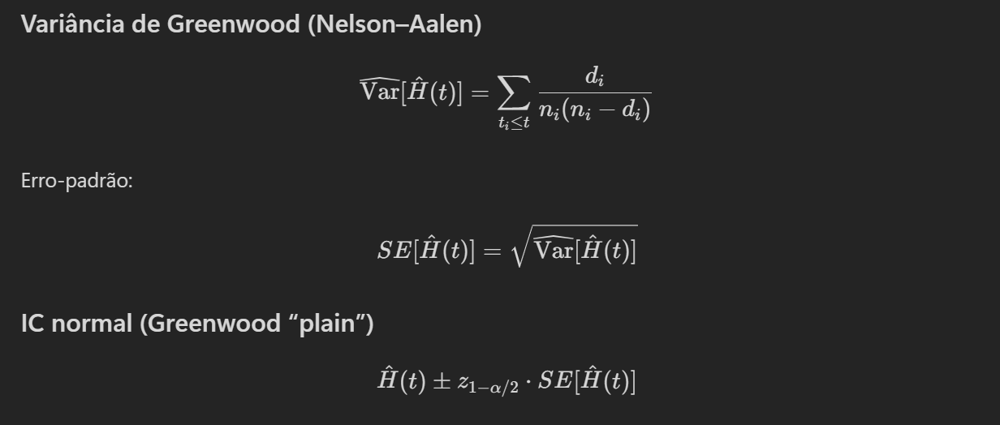

```{r}
#install.packages("ggplot2")
```

```{r}
library(survival)
#library(ggplot2)
#library(survminer)
```

# Questão 7

```{r}

# Tempo em dias desde exposição a cancerígeno até mortalidade por câncer em ratos
# Os ratos foram expostos a dois diferentes pré-tratamentos

# 0 é censura
# 1 é evento

tempo_grupo_1 <- c(143, 164, 188, 188, 190, 192, 206, 209, 213, 216, 220, 227, 230, 234, 246, 265, 304, 216, 244)

status_grupo_1 <- c(1, 1, 1, 1, 1, 1, 1, 1, 1, 1, 1, 1, 1, 1, 1, 1, 1, 0, 0)
```

```{r}
tempo_grupo_2 <- c(142, 156, 163, 198, 205, 232, 232, 233, 233, 233, 233, 239, 240, 261, 280, 280, 296, 296, 323, 204, 344)

status_grupo_2 <- c(1, 1, 1, 1, 1, 1, 1, 1, 1, 1, 1, 1, 1, 1, 1, 1, 1, 1, 1, 0, 0)
```

```{r}
dados_grupo_2 <- data.frame(
  tempo = tempo_grupo_2,
  status = status_grupo_2
)

dados_grupo_1 <- data.frame(
  tempo = tempo_grupo_1,
  status = status_grupo_1
)

dados_grupo_1
```

## Letra A



```{r}
# Letra A
# Obter intervalo de confiança
# Função de Sobrevivência Kaplan Meier - Skm (233) do grupo 2
# método de greenwod e transformação log-log
# Obs - usar alpha = 0.05

# conf.type = log-log aplica transformação log-log pra fazer transformação

ajuste_km_grupo_2_log_log <- survfit(Surv(tempo, status) ~ 1, data = dados_grupo_2, conf.type = "log-log" , conf.int  = 0.95)
summary(ajuste_km_grupo_2_log_log)
```

```{r}

(1-(1/21))*(1-(1/20))*(1-(1/19))*(1-(1/18))*(1-(1/16))*(1-(2/15))*(1-(4/13))
```

```{r}
# plain é o truncado 

ajuste_km_grupo_2_plain <- survfit(Surv(tempo, status) ~ 1, data = dados_grupo_2, conf.type = "plain" , conf.int  = 0.95)
summary(ajuste_km_grupo_2_plain)
```

```{r}
# Primeiro ajuste: S(t) do IC plain (dá no mesmo o plain e o log-log, é tudo Kaplan Meier)
plot(
  ajuste_km_grupo_2_plain,
  conf.int = FALSE,     # desenha só a curva
  col = "blue",
  lwd = 2,
  lty = 1,              # curva sólida
  xlab = "Tempo",
  ylab = "S(t)",
  main = "Kaplan–Meier: IC pontilhado, curva sólida"
)

# IC plain (pontilhado)
lines(
  ajuste_km_grupo_2_plain,
  conf.int = TRUE,
  col = "blue",
  lty = 3               # pontilhado
)

# IC log-log (pontilhado)
lines(
  ajuste_km_grupo_2_log_log,
  conf.int = TRUE,
  col = "red",
  lty = 3               # pontilhado
)

legend(
  "bottomleft",
  legend = c(
    "S(t)",
    "IC – Greenwood (plain)",
    "IC – Log-log"
  ),
  col = c("blue", "blue", "red"),
  lwd = c(2, 1, 1),
  lty = c(1, 3, 3),
  bty = "n"
)
```

```{r}
# Respondendo a Letra A

summary(ajuste_km_grupo_2_log_log, times = 233)$surv
```

```{r}
z <- qnorm(0.95)

curve(
  dnorm(x, mean = 0, sd = 1),
  from = -4, to = 4,
  main = "Distribuição Normal (média=0, desvio=1)",
  ylab = "Densidade",
  xlab = "x"
)

x_area <- seq(-4, z, length = 500)

polygon(
  c(x_area, z),
  c(dnorm(x_area), 0),
  col = rgb(0.8, 0.8, 1, 0.5),
  border = NA
)


abline(v = z, col = "red", lwd = 2, lty = 2)
```

```{r}
z <- qnorm(0.95)
print(z)
```

qnorm(0.95) significa pegar os 95% dos dados à esquerda na normal, os "95% mais usuais"

## Letra B

```{r}

ajuste_km_grupo_1_plain <- survfit(Surv(tempo, status) ~ 1, data = dados_grupo_1, conf.type = "plain" , conf.int  = 0.95)
summary(ajuste_km_grupo_1_plain)
```

```{r}
# Obter intervalo de confiança
# Risco acumulado - Estimador de Nelson-Aalen - Hna (190) do grupo 1 e 2
# método de greenwod e transformação log-log

# Nelson-Aalen - H(t) com IC padrão Grupo 1

ajuste_na_grupo_1_plain <- survfit(Surv(tempo, status) ~ 1, data = dados_grupo_1, type = "fleming-harrington", conf.type = "plain" , conf.int  = 0.95)

# resultados_g1
resultados_g1 <- summary(ajuste_na_grupo_1_plain)

# H(t) = somatório de "n eventos" / "n em risco"

# Variância do Estimador de Nelson–Aalen conforme Greenwood (imagem acima)
var_Ht <- cumsum(resultados_g1$n.event / (resultados_g1$n.risk * (resultados_g1$n.risk - resultados_g1$n.event)))

# standart error / erro padrão (imagem acima)
ep_Ht <- sqrt(var_Ht)

# IC 95% (imagem acima)
z <- qnorm(0.975)

Ht <- cumsum(resultados_g1$n.event / resultados_g1$n.risk)

Ht_lower <- Ht - z * ep_Ht
Ht_upper <- Ht + z * ep_Ht


Ht_upper <- c(-Inf, Ht_upper[-length(Ht_upper)])
Ht_lower <- c(-Inf, Ht_lower[-length(Ht_lower)])

df_na_grupo_1_plain <- data.frame(
  surv                    = resultados_g1$surv,
  time                    = resultados_g1$time,
  risco_acc               = Ht,
  risco_ic_lower          = Ht_lower,
  risco_ic_upper          = Ht_upper
)

print(df_na_grupo_1_plain)
```

```{r}
# H(t) = -log(S(t))
# Uso essa relação para recuperar tanto o IC como o H(i) em si

# Nelson-Aalen - H(t) com IC log-log Grupo 1
ajuste_na_grupo_1_log_log <- survfit(Surv(tempo, status) ~ 1, data = dados_grupo_1, type = "fleming-harrington", conf.type = "log-log" , conf.int  = 0.95)

df_na_grupo_1_log_log <- data.frame(
  surv                    = ajuste_na_grupo_1_log_log$surv,        # S(t)  
  time                    = ajuste_na_grupo_1_log_log$time,
  risco_acc               = -log(ajuste_na_grupo_1_log_log$surv),  # H(t) = -log(S(t))
  risco_ic_lower          = -log(ajuste_na_grupo_1_log_log$lower), # H(t) = -log(S(t))
  risco_ic_upper          = -log(ajuste_na_grupo_1_log_log$upper)  # H(t) = -log(S(t))
)
print(df_na_grupo_1_log_log)
```

```{r}
# Nelson-Aalen - H(t) com IC padrão Grupo 2

ajuste_na_grupo_2_plain <- survfit(Surv(tempo, status) ~ 1, data = dados_grupo_2, type = "fleming-harrington", conf.type = "plain" , conf.int  = 0.95)

# resultados_g2
resultados_g2 <- summary(ajuste_na_grupo_2_plain)

# H(t) = somatório de "n eventos" / "n em risco"

# Variância do Estimador de Nelson–Aalen conforme Greenwood (imagem acima)
var_Ht <- cumsum(resultados_g2$n.event / (resultados_g2$n.risk * (resultados_g2$n.risk - resultados_g2$n.event)))

# standart error / erro padrão (imagem acima)
ep_Ht <- sqrt(var_Ht)

# IC 95% (imagem acima)
z <- qnorm(0.975)

Ht <- cumsum(resultados_g2$n.event / resultados_g2$n.risk)

Ht_lower <- Ht - z * ep_Ht
Ht_upper <- Ht + z * ep_Ht


Ht_upper <- c(-Inf, Ht_upper[-length(Ht_upper)])
Ht_lower <- c(-Inf, Ht_lower[-length(Ht_lower)])

df_na_grupo_2_plain <- data.frame(
  surv                    = resultados_g2$surv,
  time                    = resultados_g2$time,
  risco_acc               = Ht,
  risco_ic_lower          = Ht_lower,
  risco_ic_upper          = Ht_upper
)
print(df_na_grupo_2_plain)
```

```{r}
# Nelson-Aalen - H(t) com IC log-log Grupo 2
ajuste_na_grupo_2_log_log <- survfit(Surv(tempo, status) ~ 1, data = dados_grupo_2, type = "fleming-harrington", conf.type = "log-log" , conf.int  = 0.95)

df_na_grupo_2_log_log <- data.frame(
  surv                    = ajuste_na_grupo_2_plain$surv,        # S(t)
  time                    = ajuste_na_grupo_2_plain$time,
  risco_acc               = -log(ajuste_na_grupo_2_plain$surv),  # H(t) = -log(S(t))
  risco_ic_lower          = -log(ajuste_na_grupo_2_plain$lower), # H(t) = -log(S(t))
  risco_ic_upper          = -log(ajuste_na_grupo_2_plain$upper)  # H(t) = -log(S(t))
)
print(df_na_grupo_2_log_log)
```

## Letra C

```{r}
## Definir limites comuns (opcional, mas recomendado)
x_lim <- range(
  df_na_grupo_2_plain$time,
  df_na_grupo_2_log_log$time,
  na.rm = TRUE
)

y_lim <- range(
  df_na_grupo_2_plain$risco_acc,
  df_na_grupo_2_log_log$risco_acc,
  na.rm = TRUE
)

## Primeiro gráfico (plain)
plot(
  df_na_grupo_2_plain$time,
  df_na_grupo_2_plain$risco_acc,
  type = "l",
  col  = "blue",
  lwd  = 2,
  xlim = x_lim,
  ylim = y_lim,
  xlab = "Tempo",
  ylab = "Risco acumulado",
  main = "Risco acumulado – Grupo 2"
)

## Intervalos de confiança (plain)
lines(df_na_grupo_2_plain$time,
      df_na_grupo_2_plain$risco_ic_lower,
      col = "blue", lty = 2)

lines(df_na_grupo_2_plain$time,
      df_na_grupo_2_plain$risco_ic_upper,
      col = "blue", lty = 2)

## Intervalos de confiança (log-log)
lines(df_na_grupo_2_log_log$time,
      df_na_grupo_2_log_log$risco_ic_lower,
      col = "red", lty = 2)

lines(df_na_grupo_2_log_log$time,
      df_na_grupo_2_log_log$risco_ic_upper,
      col = "red", lty = 2)

## Legenda
legend(
  "topleft",
  legend = c(
    "H(t)",
    "Plain IC",
    "Log-log IC"
  ),
  col = c("blue", "blue", "red"),
  lty = c(1, 2, 2),
  lwd = c(2, 1, 1),
  bty = "n"
)
```

```{r}
## Definir limites comuns (opcional, mas recomendado)
x_lim <- range(
  df_na_grupo_1_plain$time,
  df_na_grupo_1_log_log$time,
  na.rm = TRUE
)

y_lim <- range(
  df_na_grupo_1_plain$risco_acc,
  df_na_grupo_1_log_log$risco_acc,
  na.rm = TRUE
)

## Primeiro gráfico (plain)
plot(
  df_na_grupo_1_plain$time,
  df_na_grupo_1_plain$risco_acc,
  type = "l",
  col  = "blue",
  lwd  = 2,
  xlim = x_lim,
  ylim = y_lim,
  xlab = "Tempo",
  ylab = "Risco acumulado",
  main = "Risco acumulado – Grupo 1"
)

## Intervalos de confiança (plain)
lines(df_na_grupo_1_plain$time,
      df_na_grupo_1_plain$risco_ic_lower,
      col = "blue", lty = 2)

lines(df_na_grupo_1_plain$time,
      df_na_grupo_1_plain$risco_ic_upper,
      col = "blue", lty = 2)

## Intervalos de confiança (log-log)
lines(df_na_grupo_1_log_log$time,
      df_na_grupo_1_log_log$risco_ic_lower,
      col = "red", lty = 2)

lines(df_na_grupo_1_log_log$time,
      df_na_grupo_1_log_log$risco_ic_upper,
      col = "red", lty = 2)

## Legenda
legend(
  "topleft",
  legend = c(
    "H(t)",
    "Plain IC",
    "Log-log IC"
  ),
  col = c("blue", "blue", "red"),
  lty = c(1, 2, 2),
  lwd = c(2, 1, 1),
  bty = "n"
)
```

```{r}
# mas agora sim respondendo a pergunta 

t_alvo <- 190
print("Grupo 2")
idx <- which(df_na_grupo_2_plain$time <= t_alvo)
df_na_grupo_2_plain[idx, ][length(idx), ]
```

```{r}
print("Grupo 1")
idx <- which(df_na_grupo_1_plain$time <= t_alvo)
df_na_grupo_1_plain[idx, ][length(idx), ]
```

------------------------------------------------------------------------

```{r}
plot(
    df_na_grupo_2_log_log$time,
    df_na_grupo_2_log_log$risco_acc,
    type = "l",
    lwd  = 2,
    axes=TRUE,
    xlab = "Tempo",
    ylab = "Sobrevivência S(t)",
    col  = "red",
    yaxt = "n"

)
axis(4) 
par(new = TRUE)

plot(
    df_na_grupo_2_log_log$time,
    df_na_grupo_2_log_log$surv, 
    type = "l",
    lwd  = 2,
    axes=TRUE,
    xlab = "",
    ylab = "",
    col = "blue"
)
        
legend(
    "topright",
    legend = c("S(t) – Sobrevivência", "H(t) = -log(S(t))"),
    col    = c("blue", "red"),
    lwd    = 2,
    bty    = "n"
)
```
